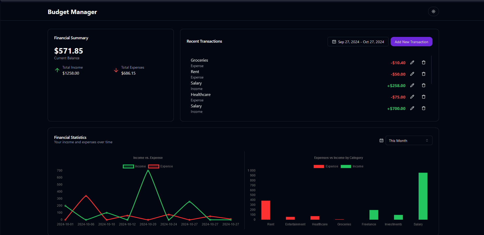

# Budget Manager

## Project Overview

This project is developed for the task outlined on [Beautiful Code](https://beautifulcode.ru/task/frontend). It focuses on creating a transaction management application that allows users to efficiently handle their financial records.




### Live on [Vercel](https://budget-manager-six-ashy.vercel.app/)

## Table of Contents

- [Features](#features)
- [Technologies](#technologies)
- [Installation](#installation)
- [Usage](#usage)
- [Scripts](#scripts)
- [Testing](#testing)

## Features

- **Transaction Tracking**: Easily add and categorize income and expenses.
- **Financial Overview**: Get a quick view of your total income, expenses, and balance.
- **Data Visualization**: Utilize charts to visualize income and expense trends.
- **Responsive Design**: Works seamlessly across devices with a modern interface.

## Technologies

- Next.js
- Tailwind
- Typescript
- Upstash Redis
- React Hot Toast
- Shadcn-ui
- Jest and React Testing Library
- Chart.js

## Installation

1. Clone the repository:

   ```bash
   git clone https://github.com/BrokenDetector/Budget-Manager.git
   cd budget-manager
   ```

2. Install dependencies:

   ```bash
   npm install
   ```

## Usage

To start the application, you have two options depending on whether you want to use Redis or just the JSON server:

### Local Development (with JSON Server)

```bash
npm run dev
```

### Local Development (with Redis)

```bash
npm run dev-redis
```

This will start the Next.js development server and the JSON server for mock API responses.

Open your browser and navigate to `http://localhost:3000` to view the app.

## Scripts

The following scripts are available in this project:

- `dev`: Starts the Next.js and JSON server for development without Redis.
- `dev-redis`: Starts the Next.js server with Redis.
- `next`: Runs the Next.js development server.
- `server`: Starts the JSON server on port 3001.
- `build`: Builds the application for production.
- `start`: Starts the production server.
- `lint`: Runs ESLint for code.
